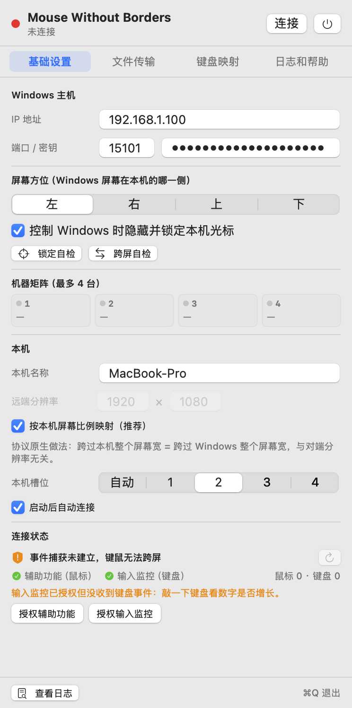

# mac端无界鼠标 (Mouse Without Borders)

**用一套键盘鼠标，同时控制你的 Mac 和 Windows。**

这是一个 macOS 客户端，可以直接连上 Windows 上 **Microsoft PowerToys → Mouse Without Borders（无界鼠标）** 的现有配置，
把你的 Mac 加进这套键鼠共享里。**Windows 端不需要安装或改动任何东西**，继续用 PowerToys 里那个就行。

> ### 📦 [**→ 点此下载最新版**](https://github.com/bunkmr/mac-mouse-without-borders/releases/latest)
> macOS 13+ ｜ Intel 与 Apple Silicon 通用二进制，一份安装包通吃 ｜ 约 1.5 MB



---

## 这是什么

Windows 上的「无界鼠标」只能让 Windows 电脑之间互联。这个程序给 Mac 补上了客户端：
一台 Mac + 一台 Windows，共用一套键鼠 —— 鼠标撞到屏幕边缘就切过去，键盘跟着走，剪贴板和文件也能互通。

> 本项目是**非官方**的第三方客户端，与 Microsoft 无关联。
> 它说的是 MWB 的原生协议，所以 Windows 端只用官方软件、不需要装任何额外程序。

---

## 功能

| 功能 | 说明 |
|:--|:--|
| 🖱️ 一套键鼠控制两台电脑 | 鼠标撞到屏幕边缘即切换，键盘自动跟随 |
| 🔁 双向控制 | Mac 控 Windows、Windows 控 Mac 都支持 |
| 🚫 本机光标自动锁定 | 控制另一台时，本机光标自动隐藏，不会两边乱跑 |
| 📋 剪贴板文字同步 | 一边复制，另一边直接粘贴 |
| 📁 拖放文件（Mac → Windows） | 把文件拖到屏幕边缘松手就发过去 |
| 📁 拖放文件（Windows → Mac） | 从 Windows 拖过来，自动保存并弹出访达选中该文件 |
| ⌘ 访达复制即传 | 在访达里 `Cmd+C` 复制文件，自动同步到 Windows |
| 🧭 屏幕方位可配 | 告诉它 Windows 屏幕在你 Mac 的左边 / 右边 / 上面 / 下面 |
| 👥 最多 4 台机器 | 与 MWB 的机器矩阵一致 |
| 🖥️ 菜单栏常驻 | 没有 Dock 图标，点菜单栏图标随时改配置 |

---

## 支持的系统

| 项目 | 支持情况 |
|:--|:--|
| **macOS** | **13.0 Ventura 及以上**（在 macOS 15 Sequoia 上实测通过） |
| **Apple Silicon（M1/M2/M3/M4）** | ✅ 原生 arm64，性能最佳 |
| **Intel Mac** | ✅ x86_64，同一安装包直接支持 |
| **Windows** | Windows 10 / 11 + Microsoft PowerToys（内含「无界鼠标」） |
| **网络** | 两台电脑需要在同一个局域网（同一个路由器 / WiFi 即可） |

安装包是**通用二进制（Universal）**，一个 DMG 同时支持 Intel 和 Apple Silicon，不用挑版本。

> ⚠️ macOS 12 及更早版本不支持 —— 程序用到了 macOS 13 才提供的系统接口。

---

## 下载与安装

### 第 1 步：下载

👉 **前往 [Releases 页面](https://github.com/bunkmr/mac-mouse-without-borders/releases/latest) 下载 `MWB-v1.3-universal.dmg`**（约 1.5 MB）

也可以直接下仓库里的那份：[dist/MWB-v1.3-universal.dmg](dist/MWB-v1.3-universal.dmg)。

### 第 2 步：安装

打开下载好的 DMG，把里面的 **MWB.app** 拖进 **应用程序（Applications）** 文件夹。

### 第 3 步：首次打开（重要）

本应用没有购买 Apple 开发者账号做签名公证，所以 macOS 第一次会拦一下。
**任选一种方式放行即可，只需操作一次：**

**方法一｜推荐，所有版本通用**

打开「终端」（启动台搜 `终端` / `Terminal`），粘贴执行：

```bash
xattr -dr com.apple.quarantine /Applications/MWB.app
```

**方法二｜macOS 13 / 14**

在访达里 **右键点 MWB.app → 选「打开」**，弹窗里再点一次「打开」。

**方法三｜macOS 15 Sequoia 及以上**

双击 MWB.app，弹窗后点「完成」；然后打开 **系统设置 → 隐私与安全性**，
滑到底部找到关于 MWB 的提示，点「仍要打开」。

### 第 4 步：授权

打开 App 后，到系统设置里给它两项权限（权限列表里名字显示为 **MWB**，两项缺一不可）：

- **系统设置 → 隐私与安全性 → 辅助功能** → 打开 MWB
- **系统设置 → 隐私与安全性 → 输入监控** → 打开 MWB

> 改完权限后建议退出 App 再重新打开一次，权限才会重新加载。
>
> **macOS 15 及以上**：第一次连接 Windows 时会弹「本地网络」授权窗，请点 **允许** —— 不点会连不上，而且不会再弹第二次。

---

## 使用

### Windows 端（设置一次即可）

1. 打开 **Microsoft PowerToys → Mouse Without Borders**
2. 确认功能已启用，并记下它显示的 **安全密钥（Security key）**
3. 建议勾上 **Transfer files between machines**（在机器之间传递文件）
   —— 不勾的话文件拖放功能用不了

### Mac 端

1. 点菜单栏上的 MWB 图标，打开配置面板
2. **IP 地址**：填 Windows 那台电脑的局域网 IP
   （在 Windows 上打开命令提示符，输入 `ipconfig`，看「IPv4 地址」那一行）
3. **端口 / 密钥**：端口默认 `15101` 不用改；密钥填 Windows 上看到的那个安全密钥
4. **屏幕方位**：选 Windows 屏幕在你 Mac 的哪一侧（比如 Windows 在右边，就选「右」）
5. 点 **连接**，状态变绿就成功了

之后把鼠标往那个方向撞到屏幕边缘，就切到 Windows 了；反方向推回来就切回 Mac。
也可以按 `Control + Option + Esc` 强制把控制权收回 Mac。

---

## 常见问题

**Q：连不上怎么办？**

- 确认两台电脑在同一个局域网，能互相访问
- 确认 Windows 上 PowerToys 的「无界鼠标」正在运行，且安全密钥填得完全一致
- macOS 15 上如果没弹过「本地网络」授权，去 **系统设置 → 隐私与安全性 → 本地网络** 里把 MWB 打开
- Windows 防火墙如果拦截了 MWB，需要在防火墙里放行

**Q：鼠标能过去，但键盘没反应？**

检查「输入监控」权限（见上面第 4 步），授完权要重启一次 App。

**Q：权限明明勾了，却一直提示未授权？**

退出 App 再打开一次。如果还不行，在「辅助功能」列表里把 MWB 那条删掉，重新添加一次。

**Q：文件拖不过去？**

- Windows 端 PowerToys 的「无界鼠标」里要勾上 **Transfer files between machines**
- 一次只能拖 **一个文件**，且**不支持整个文件夹**（多个文件请先打包成 zip）
- 拖的时候要一直按住鼠标不放，拖到屏幕边缘再松手

**Q：Windows → Mac 收到的文件存在哪？**

存在 **桌面 → MouseWithoutBorders** 文件夹里，收到后会自动弹出访达并选中该文件。

**Q：Mac 的鼠标跑到 Windows 上之后，本机鼠标还在动？**

正常情况下控制 Windows 时本机光标会自动隐藏。如果没隐藏，检查「控制 Windows 时锁定本机光标」有没有勾上。

---

## 说明与免责声明

- 本项目是**非官方**的第三方客户端，与 Microsoft 没有任何关联。
- 通信协议与 Microsoft PowerToys 的「无界鼠标」保持一致，仅供你连接**自己的**电脑使用。
- 程序需要「辅助功能」与「输入监控」权限 —— 这是所有键鼠共享类软件的必需项，
  因为它需要模拟键鼠输入、并捕获你的键鼠操作。
- 程序**不会向互联网上传任何数据**，只在你填写的那个局域网 IP 之间通信。
- 请只在**你信任的局域网**里使用；公网环境请自行评估风险。

---

## 开发

源码就在本仓库，使用 Swift Package Manager 构建。

```bash
git clone <本仓库地址>
cd mac-mouse-without-borders

# 一键打包成 .app（会自动签名并安装到 /Applications）
./build_app.sh

# 或者只编译
swift build -c release
```

需要 macOS 13+ 和 Xcode Command Line Tools（`xcode-select --install`）。

技术实现细节（协议格式、加密参数、各种踩坑记录）见 [docs/DEVELOPMENT.md](docs/DEVELOPMENT.md)。

---

<details>
<summary><b>English</b></summary>

### Mouse Without Borders — macOS client

An **unofficial** macOS client for Microsoft PowerToys' **Mouse Without Borders**.
Add your Mac to an existing MWB setup and share one keyboard and mouse across Windows and macOS —
no extra software needed on the Windows side.

**Requirements**

- macOS **13.0 Ventura** or later (tested on macOS 15 Sequoia)
- Universal binary: works on both **Apple Silicon** and **Intel** Macs
- Windows 10 / 11 with Microsoft PowerToys (Mouse Without Borders)
- Both machines on the same local network

**Features**

- Seamless edge-switching mouse & keyboard control, both directions
- Local cursor auto-hide while controlling the other machine
- Clipboard text sync
- File drag & drop in both directions (single files)
- Configurable screen position, up to 4 machines

**Install**

1. Download `dist/MWB-v1.3-universal.dmg`
2. Drag `MWB.app` into `/Applications`
3. The app is not notarized, so run once:
   ```bash
   xattr -dr com.apple.quarantine /Applications/MWB.app
   ```
   (or right-click → Open on macOS 13/14; System Settings → Privacy & Security → "Open Anyway" on macOS 15)
4. Grant **Accessibility** and **Input Monitoring** permissions to MWB
5. Allow the **Local Network** prompt on macOS 15

Then enter your Windows machine's IP, the port (`15101` by default) and the Security key
shown in PowerToys' Mouse Without Borders, pick the screen position, and hit Connect.

</details>
