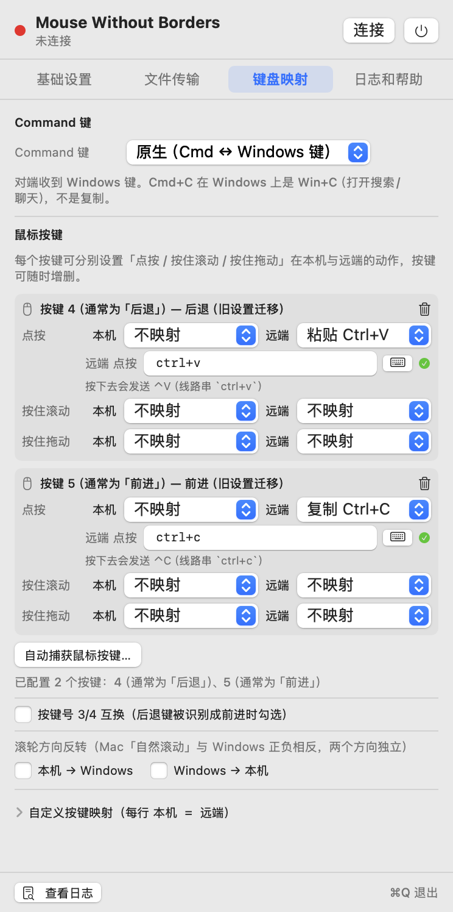

# mac端无界鼠标 (Mouse Without Borders)

**用一套键盘鼠标，同时控制你的 Mac 和 Windows。**

这是一个 macOS 客户端，可以直接连上 Windows 上 **Microsoft PowerToys → Mouse Without Borders（无界鼠标）** 的现有配置，
把你的 Mac 加进这套键鼠共享里。**Windows 端不需要安装或改动任何东西**，继续用 PowerToys 里那个就行。

> ### 📦 [**→ 点此下载最新版**](https://github.com/bunkmr/mac-mouse-without-borders/releases/latest)
> macOS 13+ ｜ Intel 与 Apple Silicon 通用二进制，一份安装包通吃 ｜ 约 2.1 MB


---

## 这是什么

Windows 上的「无界鼠标」只能让 Windows 电脑之间互联。这个程序给 Mac 补上了客户端：
一台 Mac + 一台 Windows，共用一套键鼠 —— 鼠标撞到屏幕边缘就切过去，键盘跟着走，剪贴板和文件也能互通。

> 本项目是**非官方**的第三方客户端，与 Microsoft 无关联。
> 它说的是 MWB 的原生协议，所以 Windows 端只用官方软件、不需要装任何额外程序。

---

## 功能

| 功能 | 说明 |
|:--|:--|
| 🖱️ 一套键鼠控制两台电脑 | 鼠标撞到屏幕边缘即切换，键盘自动跟随 |
| 🔁 双向控制 | Mac 控 Windows、Windows 控 Mac 都支持 |
| 🚫 本机光标自动锁定 | 控制另一台时，本机光标自动隐藏，不会两边乱跑 |
| 📋 剪贴板同步（文字 + 富文本 + 图片） | 一边复制，另一边直接粘；网页 / 微信里的富文本粘到 Word 能保留格式，**截图 / 图片**也能直接过 |
| 📁 拖放文件（Mac → Windows） | 把文件拖到屏幕边缘松手就发过去 |
| 📁 拖放文件（Windows → Mac） | 从 Windows 拖过来，自动保存并弹出访达选中该文件 |
| ⌘ 访达复制即传 | 在访达里 `Cmd+C` 复制文件，自动同步到 Windows |
| 🖱️ 可编程鼠标键 | 鼠标侧键可映射成按键序列或功能（放大缩小、水平滚动、窗口旋转…），**点按 / 按住+滚动 / 按住+拖动** 三套手势独立设置，两侧各一份 |
| ⌨️ 快捷键自动捕获 | 自定义快捷键时**按一下键盘就录进去**，不用手打 `cmd+shift+z` |
| 🗂️ 页签式设置面板 | 基础设置 / 文件传输 / 键盘映射 / 日志和帮助，四页签各管一块，找设置不再翻长列表 |
| 🧭 屏幕方位可配 | 告诉它 Windows 屏幕在你 Mac 的左边 / 右边 / 上面 / 下面 |
| 👥 最多 4 台机器 | 与 MWB 的机器矩阵一致 |
| 🖥️ 菜单栏常驻 | 没有 Dock 图标，点菜单栏图标随时改配置 |

---

## 支持的系统

| 项目 | 支持情况 |
|:--|:--|
| **macOS** | **13.0 Ventura 及以上**（在 macOS 15 Sequoia 上实测通过） |
| **Apple Silicon（M1/M2/M3/M4）** | ✅ 原生 arm64，性能最佳 |
| **Intel Mac** | ✅ x86_64，同一安装包直接支持 |
| **Windows** | Windows 10 / 11 + Microsoft PowerToys（内含「无界鼠标」） |
| **网络** | 两台电脑需要在同一个局域网（同一个路由器 / WiFi 即可） |

安装包是**通用二进制（Universal）**，一个 DMG 同时支持 Intel 和 Apple Silicon，不用挑版本。

> ⚠️ macOS 12 及更早版本不支持 —— 程序用到了 macOS 13 才提供的系统接口。

---

## 下载与安装

### 第 1 步：下载

👉 **前往 [Releases 页面](https://github.com/bunkmr/mac-mouse-without-borders/releases/latest) 下载 `MWB-v1.4.2-universal.dmg`**（约 2.1 MB）

也可以直接下仓库里的那份：[dist/MWB-v1.4.2-universal.dmg](dist/MWB-v1.4.2-universal.dmg)。

### 第 2 步：安装

打开下载好的 DMG，把里面的 **MWB.app** 拖进 **应用程序（Applications）** 文件夹。

### 第 3 步：首次打开（重要）

本应用没有购买 Apple 开发者账号做签名公证，所以 macOS 第一次会拦一下。
**任选一种方式放行即可，只需操作一次：**

**方法一｜推荐，所有版本通用**

打开「终端」（启动台搜 `终端` / `Terminal`），粘贴执行：

```bash
xattr -dr com.apple.quarantine /Applications/MWB.app
```

**方法二｜macOS 13 / 14**

在访达里 **右键点 MWB.app → 选「打开」**，弹窗里再点一次「打开」。

**方法三｜macOS 15 Sequoia 及以上**

双击 MWB.app，弹窗后点「完成」；然后打开 **系统设置 → 隐私与安全性**，
滑到底部找到关于 MWB 的提示，点「仍要打开」。

### 第 4 步：授权

打开 App 后，到系统设置里给它两项权限（权限列表里名字显示为 **MWB**，两项缺一不可）：

- **系统设置 → 隐私与安全性 → 辅助功能** → 打开 MWB
- **系统设置 → 隐私与安全性 → 输入监控** → 打开 MWB

> 改完权限后建议退出 App 再重新打开一次，权限才会重新加载。
>
> **macOS 15 及以上**：第一次连接 Windows 时会弹「本地网络」授权窗，请点 **允许** —— 不点会连不上，而且不会再弹第二次。

---

## 使用

### Windows 端（设置一次即可）

1. 打开 **Microsoft PowerToys → Mouse Without Borders**
2. 确认功能已启用，并记下它显示的 **安全密钥（Security key）**
3. 建议勾上 **Transfer files between machines**（在机器之间传递文件）
   —— 不勾的话文件拖放功能用不了

### Mac 端

1. 点菜单栏上的 MWB 图标，打开配置面板
2. **IP 地址**：填 Windows 那台电脑的局域网 IP
   （在 Windows 上打开命令提示符，输入 `ipconfig`，看「IPv4 地址」那一行）
3. **端口 / 密钥**：端口默认 `15101` 不用改；密钥填 Windows 上看到的那个安全密钥
4. **屏幕方位**：选 Windows 屏幕在你 Mac 的哪一侧（比如 Windows 在右边，就选「右」）
5. 点 **连接**，状态变绿就成功了

之后把鼠标往那个方向撞到屏幕边缘，就切到 Windows 了；反方向推回来就切回 Mac。
也可以按 `Control + Option + Esc` 强制把控制权收回 Mac。

### 鼠标侧键 / 快捷键（可选）



侧键不再只有「后退 / 前进」两个下拉框，改成**可增删的按键表**：每个键都能分别设置
**点按 / 按住+滚动 / 按住+拖动** 三种手势，在 **本机（Mac）** 与 **远端（Windows）** 两侧各配一套动作。

- 点 **自动捕获按键…** 再按一下鼠标上的键，程序自己认号，不用去数它是第几个
- 动作可以选放大缩小、水平滚动、滚动缩放、启动台（Win：开始菜单）、
  空间调度中心（Win：任务视图）、显示桌面、左右旋转窗口……也可以直接绑一段**按键序列**
- 少数鼠标把两个附加键报反了 → 勾 **按键号 3/4 互换**
- Mac 的「自然滚动」与 Windows 方向相反 → 用**滚轮方向反转**单独调某一头
- 只有**中键及以上**会被接管；左键 / 右键刻意不动，免得「点了没反应」还没法自救

自定义快捷键（比如把某个组合键绑给远端）支持**按键盘直接录**：点输入框旁的小键盘按钮，
按下你要的组合键即可；Esc 取消，12 秒没操作会自动退出。

---

## 更新记录

### v1.4.2（2026-09-19）

- 🐛 **修掉「偶尔显示已连接、但鼠标跨到 Windows 后完全不显示」的故障**。
  现象很迷惑人：状态条显示已连接，**键盘打字、点击在 Windows 上照常生效**，
  只有鼠标指针在那边**连影子都没有**。
  根因是**鼠标移动与键鼠操作走的是两条不同的发送路径** ——
  鼠标移动走独立发送线程，而断线时这条线程会被停掉，重连成功时**没人把它重新拉起来**
  ⇒ 从此每一个鼠标位置都只是把队里的旧位置顶掉、**一包也发不出去**，
  直到重启 App 才恢复。所以「键盘能用」根本不能证明鼠标那条路是通的。
  现在**重连成功时显式重启发送线程**（这是主修复）。
- ✨ **新增 1 秒哨兵自愈**：无论线程是被断线、重连还是将来任何新的退出路径停掉的，
  只要「队里压着鼠标位置、链路正常、却超过 1 秒一帧都没交付」，就**自动重启并记一条日志**。
  这把「永久失效直到重启 App」降级为「最多 1 秒的自我恢复」。
- ✨ **日志能一眼看出有没有在真发**：以前只报鼠标「造帧率」，
  故障时它照样是一片 100Hz+ 的祥和数字，把问题瞒住了；现在**同时报出
  「投递 / 实发 / 积压 / 发送线程是否存活」**，`实发 0` 且投递在涨 = 立刻可见。
- ⚡ 发送线程改为**定时唤醒（0.2 秒）**，不再无限期阻塞等待 ——
  即使出现极端卡死，最坏也只是 0.2 秒的滞后，而不是永久停摆。
- 🐛 修复**定向包的目标机器 ID 可能被随机值污染**：学习对端机器 ID 时排除掉握手包
  （它的源 ID 是随机模板值，不是真实机器号）。此前会影响**文件拖放**与
  **大图剪贴板**这两条需要"指定发给谁"的路径。

### v1.4.1（2026-09-17）

- ✨ **图片剪贴板**：现在 Mac 上截图 / 复制图片，直接到 Windows 里 `Ctrl+V` 就能粘；
  反过来 Windows 复制的图也能粘到 Mac 的微信、Word、预览里。
  ≤ 1 MB 直推，大图走 MWB 原生的「回连拉取」通道，走的是**官方协议**，Windows 端照旧不用装任何东西。
- 🐛 修复 **> 1 MB 的剪贴板内容（大图、大段文字）发不过去**：把控制权交给 Windows 时补发
  MWB 的 `MachineSwitched` 通知 —— 对端只有收到它才会回连来拉，缺了它能小数据能过、大图必丢。
- ✨ **可编程鼠标键**：侧键不再只有「后退 / 前进」两个下拉框，改成**可增删的按键表**。
  每个键有**点按 / 按住+滚动 / 按住+拖动** 3 种手势 × **本机 / 远端** 2 个侧位 = 6 项独立设置；
  可选动作包括放大缩小、垂直 / 水平滚动、滚动缩放、启动台（Win：开始菜单）、
  空间调度中心（Win：任务视图）、应用窗口、显示桌面、左右旋转窗口……也可以直接绑一段按键序列。
  点「自动捕获按键…」再按一下鼠标上的键就能自动认号；另附**按键号 3/4 互换**开关
  （少数鼠标把两个附加键反过来报）和**滚轮方向反转**开关（Mac 与 Windows 方向相反）。
- 🐛 修复侧键上绑的 `⌘C` / `⌘V` 等快捷键**在 Windows 侧失效**：手势判定现在双向都生效。
- ✨ 自定义快捷键改成**自动捕获键盘按键**：点一下输入框旁的小键盘按钮，按你要的组合键即可，
  不用再手打 `cmd+shift+z`；Esc 取消，12 秒无操作自动退出。
- ✨ **设置界面改成四个页签**：基础设置 / 文件传输 / 键盘映射 / 日志和帮助。
  连接状态条常驻顶部，找设置不用再翻一条长列表；面板同时加高，一屏放得下。
- ⚡ **CPU 占用大幅下降**：鼠标移动改为「最新值合流 + 独立发送线程」，
  连接状态轮询只在数值真的变化时才刷新界面 —— 之前打开面板时会有十几~二十几个百分点的占用。
- 🐛 修复 Web 页里复制的富文本在 Mac 侧粘出来夹带 HTML 源码残渣的问题（延续 v1.4 的剪贴板解析修复）。

### v1.4（2026-09-16）

- 🐛 **修复剪贴板粘出来是乱码**：从 Windows 复制文字过来，偶尔会夹带一长串
  `{4CFF57F7-…}` 分隔符和 `Version:0.9 / StartHTML:…` 之类的 HTML 源码残渣
  （在企业微信、浏览器等复制富文本时最容易出现）。现在会正确识别剪贴板包，
  只取出干净的文字。
- ✨ 顺带支持**富文本**：网页 / 微信里复制的带格式内容，粘到 Word、邮件里
  能保留格式，粘到纯文本框仍是干净文字 —— 和 Windows 原生一样。
- 🐛 修复 Mac → Windows 复制时，内容刚好以 `TXT` / `HTM` / `RTF` 开头会少掉
  前 3 个字的问题。

### v1.3（2026-09-14）

- 首个发布版：一套键鼠控制两台电脑、本机光标自动锁定、剪贴板同步、
  文件拖放（双向）、访达复制即传、屏幕方位可配。

---

## 常见问题

**Q：连不上怎么办？**

- 确认两台电脑在同一个局域网，能互相访问
- 确认 Windows 上 PowerToys 的「无界鼠标」正在运行，且安全密钥填得完全一致
- macOS 15 上如果没弹过「本地网络」授权，去 **系统设置 → 隐私与安全性 → 本地网络** 里把 MWB 打开
- Windows 防火墙如果拦截了 MWB，需要在防火墙里放行

**Q：鼠标能过去，但键盘没反应？**

检查「输入监控」权限（见上面第 4 步），授完权要重启一次 App。

**Q：权限明明勾了，却一直提示未授权？**

退出 App 再打开一次。如果还不行，在「辅助功能」列表里把 MWB 那条删掉，重新添加一次。

**Q：文件拖不过去？**

- Windows 端 PowerToys 的「无界鼠标」里要勾上 **Transfer files between machines**
- 一次只能拖 **一个文件**，且**不支持整个文件夹**（多个文件请先打包成 zip）
- 拖的时候要一直按住鼠标不放，拖到屏幕边缘再松手

**Q：Windows → Mac 收到的文件存在哪？**

存在 **桌面 → MouseWithoutBorders** 文件夹里，收到后会自动弹出访达并选中该文件。

**Q：复制的图片过不去？**

Mac 侧截图（`⌘⇧4`）或复制图片后，到 Windows 里 `Ctrl+V` 即可；反方向也一样。
若粘出来是空白，先确认两边是同一个 MWB 连接、并在设置里没关掉图片同步。
说明一点取舍：**在访达里 `⌘C` 一个图片文件，走的是文件通道**（会落到对端桌面文件夹），
而不是图片剪贴板 —— 这是刻意的，跟 Windows 原生行为一致。

**Q：给鼠标侧键绑了 `⌘C` / `⌘V`，到 Windows 上怎么不管用？**

先在「键盘映射」页签里确认这个侧键的**远端**侧配置了动作（本机 / 远端是两套独立设置）。
手势判定已修成双向生效，如果仍不灵，用「自动捕获按键…」重新认一次按键号，
并对付个别鼠标把 3/4 号报反的情况，打开 **按键号 3/4 互换**。

**Q：Mac 的鼠标跑到 Windows 上之后，本机鼠标还在动？**

正常情况下控制 Windows 时本机光标会自动隐藏。如果没隐藏，检查「控制 Windows 时锁定本机光标」有没有勾上。

**Q：鼠标移动时，每隔约半秒会轻微卡一下？**

先看有没有开 **iPad 随航（Sidecar）副屏**、**隔空投送（AirDrop）** 或 **接力（Handoff）**。

Mac 只有**一个 Wi‑Fi 射频**。当它还要同时服务「随航副屏」「隔空投送」「接力」这类
Apple 设备直连功能时，就必须**周期性地离开路由器信道**去和 iPad / iPhone 对一下话。
离开的那几十毫秒里，发往 Windows 的鼠标位置包会全部排队、等回来时一次性放行 ——
表现出来就是**每隔约 0.5 秒轻轻顿一下**。

按推荐顺序处理：

1. **插网线** —— 有线不走 Wi‑Fi，这个问题直接消失（最省事）
2. 跨屏工作时**断开随航副屏**（菜单栏「屏幕镜像」里断开 iPad）
3. 关掉**隔空投送 / 接力**：系统设置 → 通用 → 隔空投送与接力

想自己确认一下（Mac 上打开「终端」）：

```bash
ping -c 120 -i 0.05 192.168.1.1    # 换成你自己路由器的地址
```

- 如果 `max` 明显比 `avg` 大（例如 avg 2ms 但 max 100ms+），并且**大致每隔 10 个包出现一次**，
  就符合上面说的「射频分时」或「路由器省电节拍」
- 如果 `min/avg/max/stddev` 都是几毫秒、很平，那这条链路是好的，卡顿另有原因

> 要打**路由器**的地址，不要打 Windows 那台 —— Windows 默认会丢弃 ping，
> 打它永远是 100% 丢包，会让人误判成「网络断了」。

---

## 说明与免责声明

- 本项目是**非官方**的第三方客户端，与 Microsoft 没有任何关联。
- 通信协议与 Microsoft PowerToys 的「无界鼠标」保持一致，仅供你连接**自己的**电脑使用。
- 程序需要「辅助功能」与「输入监控」权限 —— 这是所有键鼠共享类软件的必需项，
  因为它需要模拟键鼠输入、并捕获你的键鼠操作。
- 程序**不会向互联网上传任何数据**，只在你填写的那个局域网 IP 之间通信。
- 请只在**你信任的局域网**里使用；公网环境请自行评估风险。

---

## 开发

源码就在本仓库，使用 Swift Package Manager 构建。

```bash
git clone <本仓库地址>
cd mac-mouse-without-borders

# 一键打包成 .app（会自动签名并安装到 /Applications）
./build_app.sh

# 或者只编译
swift build -c release
```

需要 macOS 13+ 和 Xcode Command Line Tools（`xcode-select --install`）。

技术实现细节（协议格式、加密参数、各种踩坑记录）见 [docs/DEVELOPMENT.md](docs/DEVELOPMENT.md)。

---

<details>
<summary><b>English</b></summary>

### Mouse Without Borders — macOS client

An **unofficial** macOS client for Microsoft PowerToys' **Mouse Without Borders**.
Add your Mac to an existing MWB setup and share one keyboard and mouse across Windows and macOS —
no extra software needed on the Windows side.

**Requirements**

- macOS **13.0 Ventura** or later (tested on macOS 15 Sequoia)
- Universal binary: works on both **Apple Silicon** and **Intel** Macs
- Windows 10 / 11 with Microsoft PowerToys (Mouse Without Borders)
- Both machines on the same local network

**Features**

- Seamless edge-switching mouse & keyboard control, both directions
- Local cursor auto-hide while controlling the other machine
- Clipboard text sync
- File drag & drop in both directions (single files)
- Configurable screen position, up to 4 machines

**Install**

1. Download `dist/MWB-v1.4.2-universal.dmg`
2. Drag `MWB.app` into `/Applications`
3. The app is not notarized, so run once:
   ```bash
   xattr -dr com.apple.quarantine /Applications/MWB.app
   ```
   (or right-click → Open on macOS 13/14; System Settings → Privacy & Security → "Open Anyway" on macOS 15)
4. Grant **Accessibility** and **Input Monitoring** permissions to MWB
5. Allow the **Local Network** prompt on macOS 15

Then enter your Windows machine's IP, the port (`15101` by default) and the Security key
shown in PowerToys' Mouse Without Borders, pick the screen position, and hit Connect.

</details>
